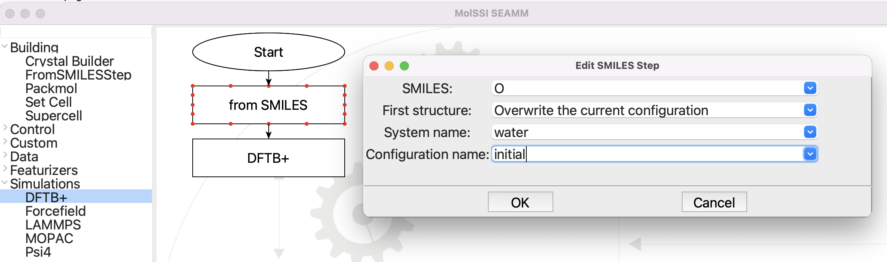
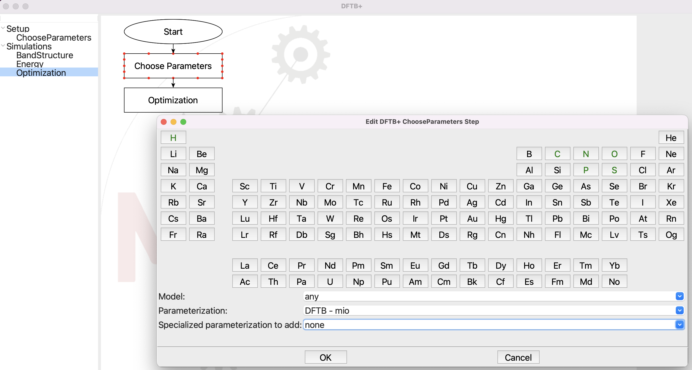
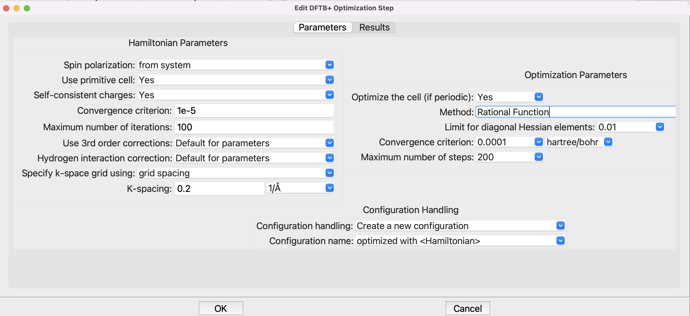
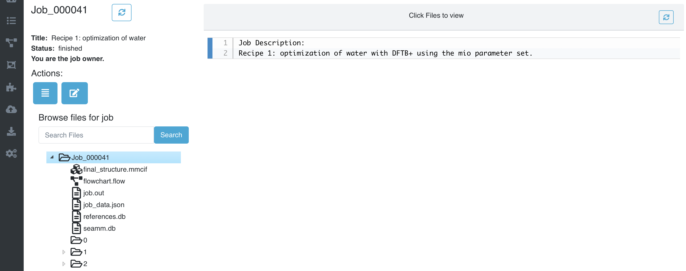
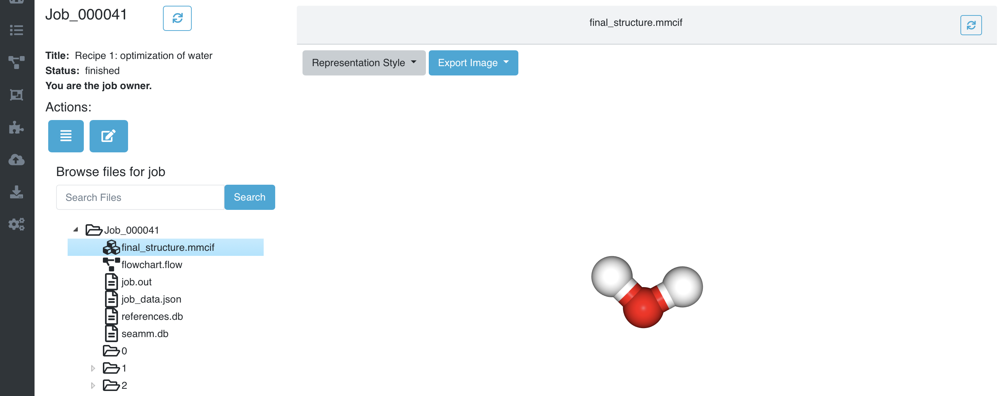

-----------------------------------------------
Recipe 1: First Calculation with DFTB+ in SEAMM
-----------------------------------------------

Tutorial
--------
This first recipe is a simple introduction to optimizing a structure -- water -- using
DFTB+ and examining the output. In the `recipe on the DFTB+ website
<https://dftbplus-recipes.readthedocs.io/en/latest/basics/firstcalc.html>`_ you type in
the coordinates for the atoms, use the `mio-ext` parameter set, and set up the
optimization. We will do the same, but use the `from-smiles-step` to create the water
molecules from its SMILES string:

   
   The flowchart and input for From SMILES

The flowchart is very simple. It builds the structure from SMILES, and then runs
DFTB+. The input for the From SMILES step is shown in the picture above. The only
important parameter is **SMILES**, which is set to "O", which is the SMILES
representation for water.

.. note::
   If you aren't familiar with SEAMM and its flowcharts, there is a more `gentle
   introduction <https://molssi-seamm.github.io/tutorials/index.html>`_ in the SEAMM
   documentation.

If you are not familiar with SMILES, it is a convenient representation of moleculaes
particularly organic molecules. It was created by Daylight Chemical Information Systems,
which has a nice `tutorial
<https://www.daylight.com/dayhtml_tutorials/languages/smiles/index.html>`_ The EPA,
which is where the original work on SMILES was done, also has nice `introduction
<https://archive.epa.gov/med/med_archive_03/web/html/smiles.html>`_. Most databases of
molecules have SMILES, as does Wikipedia, so using SMILES is a conveninet way to create
molecules. 

The DFTB+ flowchart is also very simple:

   
   Choosing the parameters for DFTB+.

The DFTB+ step in SEAMM uses the newer `3ob` parameter set by default, so you need to
change to the `mio` set as shown in the dialog.

The defaults for the optimization will work fine, so there is no need to make any
changes:

The DFTB+ subflowchart is also very simple:

   
   Optimization setup for DFTB+.

Note that the original recipe uses the Conjugate Gradient driver, which is being phased
out, so we will use the default Rational Function optimizer.

When you have finished the DFTB+ subflowchart, close it and then run the calculation
using File / Run or ctrl-R (cmd-R on a Mac):

.. figure:: images/recipe_1_run.png
   :align: center
   :alt: Running the job
   
   Running the job.

Now head over to your browser and pull up the Dashboard. Find the job that you just ran,
so that you can examine the input and output files. Here it is in my list of jobs in the
Dashboard:

   
   List of Jobs in DashBoard

Click on the Job number in the left column (41 in the example) to go to the job's page:

   
   The main page for the job

The left pane shows the list of files and folders in the Job. If you click on one of the
files it will be displayed in the right pane. `final_structure.mmcif` shows the last
structure:

   
   The optimized water molecule

That looks right! You can rotate the picture by dragging the mouse over it.

Look at the `job.out` file next. This has the principle output of the job, plus any
warnings or errors. The first part is a summary of the job that is written before any
calculations are run so that you can see what it is going to do before it runs a long
time -- though our tiny job finished almost immediately::

  Running in directory '/Users/psaxe/SEAMM/Jobs/projects/recipes/Job_000041'

  Description of the flowchart
  ----------------------------
  Step 0: Start  2022.7.25

  Step 1: from SMILES  2021.10.13
      Create the structure from the SMILES 'O', overwriting the current
      configuration. The name of the system will be water. The name of the
      configuration will be initial.

  Step 2: DFTB+  2022.7.24

     Step 2.1: Choose Parameters
         Using the 'DFTB - mio' set of Slater-Koster parameters.

     Step 2.2: Optimization
         Structural optimization using the Rational Function method with a
         convergence criterion of 0.0 hartree/bohr. A maximum of 200 steps will be
         used.

         Doing a self-consistent charge calculation with a convergence criterion of
         1e-05 charge units and a limit of 100 iterations. Whether to do a 3rd order
         calculation and if so, what type, will be determined by the parameter set
         used. Whether and how to correct interactions with hydrogen atoms will be
         determined by the parameter set used. Any spins will be optimized. For
         periodic system a Monkhorst-Pack grid with a spacing of 0.2 1/Å will be
         used.

The next part shows what actually happened::

  Running the flowchart
  ---------------------
  Step 0: Start  2022.7.25

  Step 1: from SMILES  2021.10.13
      Create the structure from the SMILES 'O', overwriting the current
      configuration. The name of the system will be water. The name of the
      configuration will be initial.

      Created a molecular structure with 3 atoms.
             System name = water
      Configuration name = initial

  Step 2: DFTB+  2022.7.24

      Step 2.1: Choose Parameters
          Using the 'DFTB - mio' set of Slater-Koster parameters.

      Step 2.2: Optimization
          Structural optimization using the Rational Function method with a
          convergence criterion of 0.0001 E_h/a_0. A maximum of 200 steps will be
          used.

          Doing a self-consistent charge calculation with a convergence criterion of
          1e-05 charge units and a limit of 100 iterations. Whether to do a 3rd order
          calculation and if so, what type, will be determined by the parameter set
          used. Whether and how to correct interactions with hydrogen atoms will be
          determined by the parameter set used. Any spins will be optimized. For
          periodic system a Monkhorst-Pack grid with a spacing of 0.2 1/Å will be
          used.

          The geometry optimization converged in 5 steps. The last change in
          energy was 0.0 Eh.

          The total energy is -4.077938 E_h. The charges converged to 0.000006.
          The calculated formation energy is -284.2 kJ/mol.

                     Atomic charges
             +--------+-----------+----------+
             |  Atom  |  Element  |   Charge |
             |--------+-----------+----------|
             |   1    |     O     |    -0.59 |
             |   2    |     H     |     0.3  |
             |   3    |     H     |     0.3  |
             +--------+-----------+----------+

  Wrote the final structure to 'final_structure.mmcif' for viewing.

This is similar to the initial summary of the job, but this time it has detail about
the number of atoms in the system that was built, how many iterations the calculation
took, the energy `-4.077938 E_h`, etc.

If you read the DFTB+ tutorial, it shows the detailed output from DFTB+, and near the
end is this section::

  ***  Geometry step: 12

    iSCC Total electronic   Diff electronic      SCC error
      1   -0.41505816E+01    0.00000000E+00    0.20115717E-02
      2   -0.41505816E+01   -0.21681791E-07    0.14908557E-02
      3   -0.41505816E+01   -0.26422777E-07    0.27122328E-07

   Total Energy:                      -4.0779379339 H         -110.9663 eV
   Total Mermin free energy:          -4.0779379339 H         -110.9663 eV
   Maximal force component:            0.280551E-05
  >> Charges saved for restart in charges.bin

   Geometry converged

Note that the energy given in `job.out`, `-4.077938 E_h`, is the same as the final
energy in the original DFTB+ example, rounded to 6 decimal places. So we have reproduced
the original recipe using SEAMM and get the same answer.

.. note::
  If you want to see the input and output files for DFTB+, you can. They are in
  subfolders that correspond to the step number the flowchart. DFTB+ is the second step
  in the flowcharts, so open the folder '2'. The optimization was step '2.2', so open
  the folder '2' that is in the first folder '2', i.e. 2/2.

`job.out` reports another energy, the formation energy `-284.2 kJ/mol`. This is almost
the enthalpy (or heat) of formation, :math:`ΔH_f`, that chemists typically use. What is
printed is actually :math:`ΔE_f`, i.e. the electronic energy of formation rather than
the enthalpy, which includes other terms such as the zero-point energy and thermal
energy. These terms tend to be relatively small, so :math:`ΔE_f ≈ ΔH_f`, and hence is
quite useful.

.. note::
   :math:`ΔE_f` is calculated from the chemical reaction to create the compound from
   elements in their standard state. For water, the reaction is::

     H₂(g) + ½O₂(g) --> H₂O(l)

   which gives
   
   .. math::

      ΔE_f = E(H₂O) - E(H₂) - ½E(O₂)

   The DFTB+ plug-in for SEAMM has tables of the energy of the elements in their
   standard state, calculated using the various parameter sets. It uses these energies
   in the equation above to calculate :math:`ΔE_f`. Not all element and parameter set
   combinations have been calculated yet, and occasionally there is a problem with the
   calculation, so some reference energies are missing, in which case the output let's
   you know.

The final part of `job.out` is a list of references for the codes used, which are the
appropriate citations for publications using the results::

  Primary references:

  (1) Jessica Nash and Eliseo Marin-Rimoldi and Mohammad Mostafanejad and Paul
      Saxe. SEAMM: Simulation Environment for Atomistic and Molecular Modeling,
      version 2022.7.25; The Molecular Sciences Software Institute (MolSSI):
      Virginia Tech, Blacksburg, VA, USA, https://doi.org/10.5281/zenodo.5153984,
      DOI: 10.5281/zenodo.5153984

  (2) O'Boyle, Noel M. and Banck, Michael and James, Craig A. and Morley, Chris
      and Vandermeersch, Tim and Hutchison, Geoffrey R. Open Babel: An open
      chemical toolbox. Journal of Cheminformatics 2011, 3, 33. DOI:
      10.1186/1758-2946-3-33

  (3) Hourahine, B.; Aradi, B.; Blum, V.; Bonafé, F.; Buccheri, A.; Camacho, C.;
      Cevallos, C.; Deshaye, M. Y.; Dumitrică, T.; Dominguez, A.; Ehlert, S.;
      Elstner, M.; van der Heide, T.; Hermann, J.; Irle, S.; Kranz, J. J.; Köhler,
      C.; Kowalczyk, T.; Kubař, T.; Lee, I. S.; Lutsker, V.; Maurer, R. J.; Min,
      S. K.; Mitchell, I.; Negre, C.; Niehaus, T. A.; Niklasson, A. M. N.; Page,
      A. J.; Pecchia, A.; Penazzi, G.; Persson, M. P.; Řezáč, J.; Sánchez, C. G.;
      Sternberg, M.; Stöhr, M.; Stuckenberg, F.; Tkatchenko, A.; Yu, V. W.-z.;
      Frauenheim, T. DFTB+, a software package for efficient approximate density
      functional theory based atomistic simulations. The Journal of Chemical
      Physics 2020, 152, 124101. DOI: 10.1063/1.5143190

  Secondary references:

  (1) Paul Saxe. From Smiles plug-in for SEAMM for creating structures from
      SMILES, version 2021.10.13; The Molecular Sciences Software Institute
      (MolSSI): Virginia Tech, Blacksburg, VA, USA, https://github.com/molssi-
      seamm/from_smiles_step, DOI: 10.5281/zenodo.5159800

  (2) Paul Saxe. DFTB+ plug-in for SEAMM, version 2022.7.24; The Molecular
      Sciences Software Institute (MolSSI): Virginia Tech, Blacksburg, VA, USA,
      https://github.com/molssi-seamm/dftbplus_step

This simple calculation doesn't use many codes, but the list of references can become
quite long. It is divided into sections based on a loose sense of importance to help you
manage your citations.

Summary
-------
This job is as simple as it gets! Just two steps, one to build the structure and one to
run the calculation, with all the parameters hard-wired. However, it already shows to
power of SEAMM compared to running the calculation from the command-line. You didn't
need to edit the input file `dftb_in.hsd` and know the right keywords. Nor did you have
to get the geometry of the molecule -- though water is not that challenging.

You had to construct a flowchart, which was quite straightforward. You needed to enter
the SMILES for water, but no geometry. Otherwise you could use the default parameters
except for changing the parameter set from the default `3ob` to the `mio` set to match
the example from the DFTB+ website.

Mainly we focussed on looking through the output in the Dashboard. While you can see all
the input to and output from DFTB+, we concentrated on the `job.out` file, which is a
useful summary of the calculations and also contains other useful information.

In the `next tutorial <recipe_1_extended>`_ you will generalize this flowchart to make a
more useful flowchart optimizing the structure of any (small) organic molecule.
