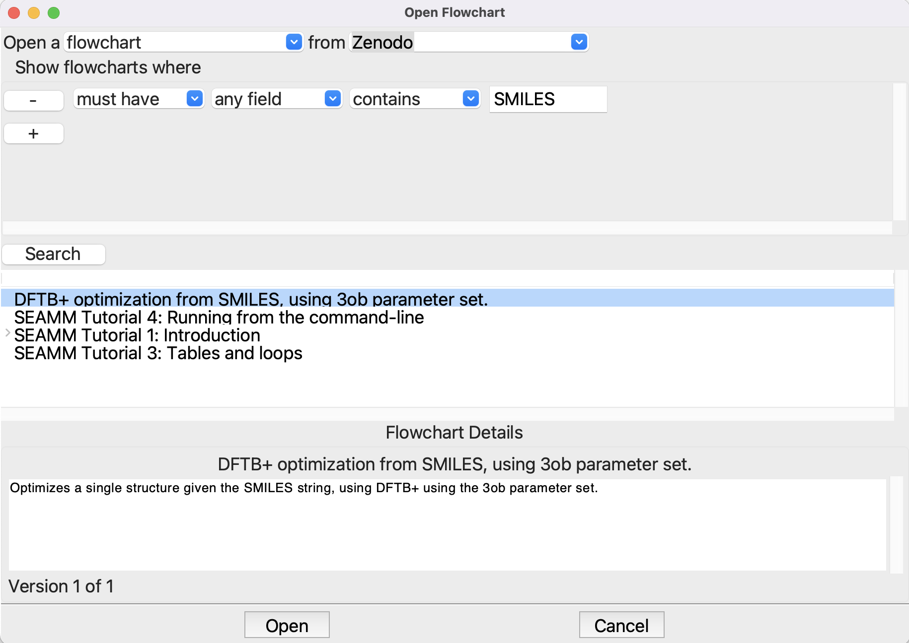
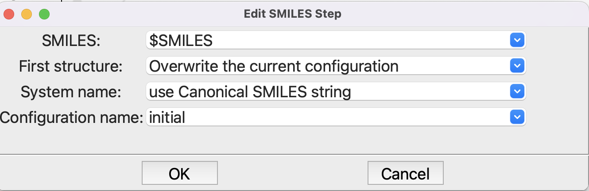

--------------------------------------------------
Recipe 1 extended: More flexible, useful workflows
--------------------------------------------------

Introduction
------------
Recipe 1 is a great introduction to running DFTB+. If you read the `recipe on the DFTB+
website <https://dftbplus-recipes.readthedocs.io/en/latest/basics/firstcalc.html>`_, it
is quite long and detailed because it is introducing the input to DFTB+ as well as the
manually creating the structure. By contrast, setting up the same calculation in SEAMM,
:doc:`example <recipe_1>` is trivial -- use SMILES to create the structure and a very
simple DFTB+ flowchart to optimize the structure. The only thing we had to change from
the defaults was the parameter set to use. Most of the tutorial was about understanding
the output in the Dashboard, `job.out` in particular.

Hard-wiring the molecule in the **from SMILES step** works, but is a bit
cumbersome. Sure, you can edit the flowchart every time you want to run a different
molecule, but there should be a better way. There is! SEAMM supports input parameters
for flowcharts. The **parameters step** handles this. You could edit the exisiting
flowchart to add this, but let's try something new. Let's get the flowchart from Zenodo.

If you are not familiar with `Zenodo <https://zenodo.org>`_ you might want to head over
there and look around. Zenod is a fantastic resource for storing and sharing data,
documents, release of code, etc. getting a DOI in the process. DOI's are used for
archival storage. Once a DOI is minted for the data, the data can no longer be changed,
though new versions, with new DOI's can be stored. You can also go directly to the
flowchart that we are interest in at https://doi.org/10.5281/zenodo.7013212 Zenodo also
supports communities, and there is one for `SEAMM flowcharts
<https://zenodo.org/communities/seamm-flowcharts>`_ where you can search and browse
available flowcharts. As you become more familiar with SEAMM you should consider
uploading useful flowcharts to Zenodo and submitting them to the community. You can
upload directly from SEAMM!

Tutorial
--------

You can also open a flowchart from Zenodo directly in SEAMM. Start SEAMM and either
select **File/Open** or use the shortcut **ctrl-O** (**cmd-O** on a Mac). When the
dialog appears, change the **From** filed from *local files* to *Zenodo*. The **Show
flowcharts where** section, click the **+** button and fill out the line to read "must
have any field contains SMILES" and click the **Search** button:

   
   Opening a flowchart from Zenodo

We want the flowchart "DFTB+ optimization from SMILES, using 3ob parameter set", so
select it. The description of the flowchart will appear in the **Details** area -- this
is how you can browse the flowcharts to find one that you want. Click **Open** to open
the selected flowchart:

.. figure:: images/recipe_1_extended_parameters.png
   :align: center
   :alt: Flowchart with **Parameters** dialog open
   
   Flowchart with **Parameters** dialog open

You can click the **Edit** button next to the SMILE parameter to see how the parameters
are setup. Just click **Cancel** to exit the dialog so that you don't accidentally make
any changes. This defines a parameters *SMILES* that we set when we submit the job. This
allows you to run different molecules easily. There is one more change from the original
flowchart, in the **from SMILES step**:

   
   Editing the **from SMILES step**

Note that rather the have the SMILES string in the first field, we use the parameter
prefixed by a dollar sign to indicate that it is a variable, not a string.

That's it! Now submit the job (**File/Run** or **ctrl-R**):

.. figure:: images/recipe_1_extended_submit.png
   :align: center
   :alt: Submitting the job with a parameter
   
   Submitting a job with a parameter

Once the job finishes, you can look at the structure and outputs. Note that, unless you
changed the flowchart, it is using the newer **3ob** parameter set, so if you run water
again you will get similar but slightly different results. Note that for toluene the
calculated :math:`ΔE_f = 40` kJ/mol. The `experimental
<https://webbook.nist.gov/cgi/cbook.cgi?ID=C108883&Units=SI&Mask=1#Thermo-Gas>`_
:math:`ΔH_f ≈ 50 ± 1`, so reasonable agreement.

Summary
-------
In this tutorial you have seen how to make a general, useful flowchart. SMILES is an
excellent way to construct small organic molecules, and it is easy to find the SMILES
for many molecules by searching on the Internet or looking in databases such as `PubChem
<https://pubchem.ncbi.nlm.nih.gov>`_. The SMILES "language" is also quite easy to
learn. With a little practice you can easily generate most small molecules. Later in
these tutorials you will see a similar approach based on structure files, which is a bit
more general and also works for crystalline systems, where there is no equivalent of
SMILES.

You should also be aware of the limitations of this approach. The principal issue is the
optimized structure is a local minimum, not necessarily the global minimum, which is
usual what you are interested in. This is not an issue with small molecules, but as the
system size increases, and particularly for "floppy" molecules with many rotatable
bonds, finding the global minimum is quite difficult. And in some senses the concept of
a structure -- a minimum on the potential energy surface -- is not very useful. Flexible
molecules change their conformation rapidly and are better thought of as having an
ensemble of structures.

There are many tools for locating global minima and for sampling ensembles of
molecules. These are not yet available as plug-ins in SEAMM, but hopefully will be
soon.

Of course, the other limitation is the approximations inherent in DFTB+ and the
parameterizations used. You should read about the science underpinning `DFTB+
<https://dftbplus.org/about-dftb>`_, and the descriptions of the parameterizations at
the `DFTB website <https://dftb.org/parameters/download>`_ and references therein.
