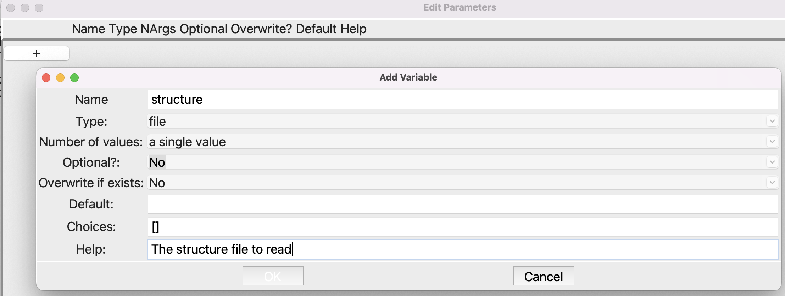
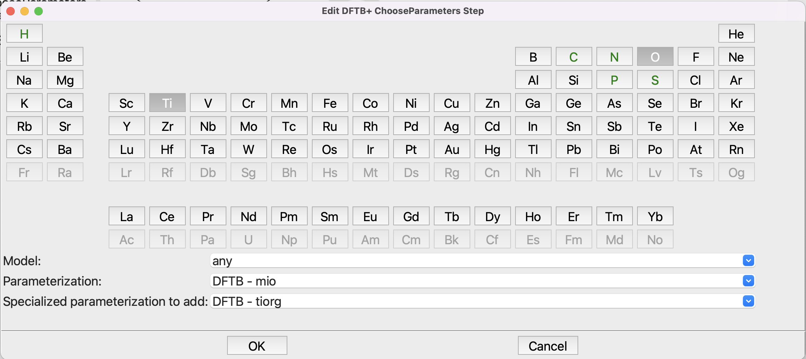
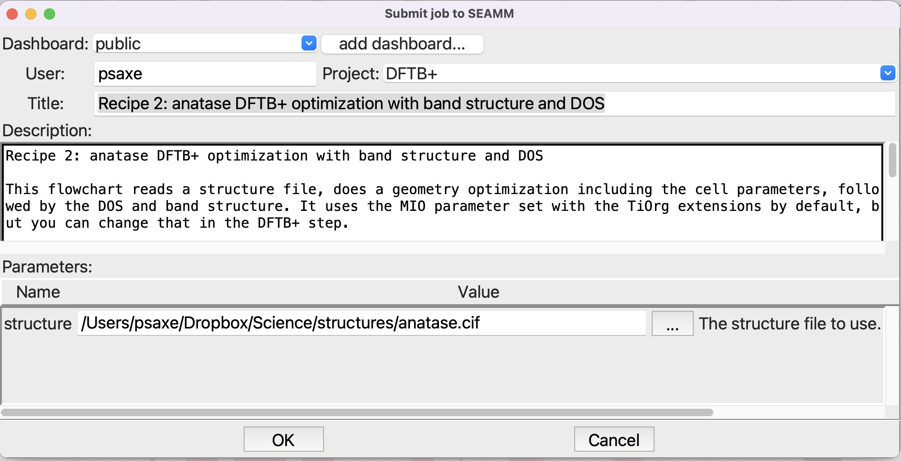

-----------------------------------------------
Recipe 2: Band structure, DOS and PDOS in SEAMM
-----------------------------------------------

Introduction
------------
The `second recipe
<https://dftbplus-recipes.readthedocs.io/en/latest/basics/bandstruct.html>`_ on the
DFTB+ website. This covers calculating the band structure, density of states (DOS), and
partial DOS on the atoms, which helps us understand the electronic structure of any
periodic system. We will generally follow their prescription, adapting it for SEAMM. The
approach is similar:

#. Calculate and save the charges on the system using a self-consistent charge (SCC)
   calculation with a good-enough sampling of the reciprocal space (k-point
   sampling). This is done automatically in SEAMM whenever you calculate the energy or
   optimize the structure with DFTB+.
#. Then, keeping the charges fixed, calculate the band energies on a large k-point grid
   to create the DOS.
#. And again keeping the charges fixed, calculate the band energies on a path through
   the Brillouin zone made of about 100 points.

The recipe on the DFTB+ website combined the first two steps into one. The approach
taken in the SEAMM DFTB+ plug-in is perhaps a bit more general, and allows you to
calculate the DOS over a fine grid of k-points which might be overkill for the energy
and charges for larger systems. Since the DOS calculation is equal to just one iteration
of an energy calculation, this can be a considerable savings, particularly if the
initial step is a geometry optimization.

Tutorial
--------
This is the flowchart that we need to make:

.. figure:: images/recipe_2_flowchart.png
   :align: center
   :alt: The flowchart for the band structure and DOS
   
   The flowchart for the band structure and DOS

Open the **Parameters** step and set up the parameters like this:

   
   Setting up the **Parameters** step

Note that the type is *file*. After you click **OK** to close the smaller dialog, the
**Parameters** dialog should look like this:

.. figure:: images/recipe_2_parameters.png 
   :align: center
   :alt: Setting up the **Parameters** step
   
   Setting up the **Parameters** step

This will create a variable *structure* which we use in the **Read Structure**
step. Note the dollar sign "$" in front of the variable:

.. figure:: images/recipe_2_read.png
   :align: center
   :alt: Setting up the **Read Structure** step
   
   Setting up the **Read Structure** step

Now that we have a structure, it is time for the **DFTB+** step:

.. figure:: images/recipe_2_dftb+_flow.png
   :align: center
   :alt: The flowchart for the **DFTB+** step
   
   The flowchart for the **DFTB+** step

You should be familair with the **Choose Parameters** step. You can click on **Ti** and
**O** to narrow the choice of parameters down, but in any case select the **mio**
parameterization with the **tiorg** specialized parameters:

   
   Setting up the **Choose Parameters** step

You can use the defaults in the remaining steps. They are reasonable. Note that the
k-mesh is defined using a spacing, in reciprocal Å, rather than as an explicit
e.g. 8x8x8 grid. DFTB+ is after all performing a numerical integration over the
reciprocal space, so a spacing between points is a senseible measure of the accuracy of
the grid. It automatically adjust to the the size of the periodic cell. A large cell has
a small reciprocal space, so doesn't need many k-points for the integration. Conversely
a small cell has a large reciprocal space, and requires a large k-mesh for accuracy. A
spacing of 0.2 1/Å is reasonable. Magnetic systems might require a smaller spacing,
perhaps 0.1 1/Å, while insulators are less demanding, so spacings up to 0.5 1/Å may be
OK. You should of course test!

Now you are ready to run, but you need a structure for anatase. A quick search of the
Internet will turn up some or you can download :download:`this one
<http://rruff.geo.arizona.edu/AMS/download.php?id=11458.cif&down=cif>` which came from
the `American Minerologist Crystal Structure Database
<http://rruff.geo.arizona.edu/AMS/amcsd.php>`_. Save the structure on you disk, then
submit the job (**file/run** or **ctrl-R**):

   
   Submitting the job

You can click on the **...** button at the right of the **structure** entryfield to
navigate to the file and select it, rather than trying to type in the path. This job
will take a little time, perhaps a minute to run, because we are optimizing the structure
and unit cell. 

Looking at the Results
----------------------
Go to your Dashboard in the browser, find the job that you just submitted, and open the
job. Once it finishes -- you can use the refresh button next to the job number at top
left to check if it has finished -- you can look at the structure and `job.out`. But we
are interested in the band structure and DOS. You'll find it in the subfolder **3/4**,
which corresponds to the **Band Structure** substep of the **DFTB+** step. You'll find a
file called `band_structure.graph` with a graph icon. Click on it to open on the right
side of the window:

.. figure:: images/recipe_2_bandstructure.png
   :align: center
   :alt: Viewing the band structure and DOS in the Dashboard
   
   Viewing the band structure and DOS in the Dashboard

.. note::
   If you are just reading through this tutorial and not running it, you can see the job
   at our `public dashboard <http://137.184.43.219:5000/#/jobs/10>`_ and `just the graph
   <../../_static/recipe_2_band_structure.html>`_.

That was simple! Unlike the picture above, the actual band structure / DOS plot is
interactive. You can zoom by dragging a rectangle across either the band structure of
DOS portion of the graph. The legend to the right is also active. Click on an entry to
turno it on or off. Double-clicking on an entry turns off all the rest, leaving just
it. The entries for the DOS are at the bottom of the legend. You may have to scroll the
legend to get to them.

Here is picture showing just the bands immediately above and below the Fermi energy, and
the O_p (red) and Ti_d (green) partial DOS.

.. figure:: images/recipe_2_bandstructure_zoomed.png 
   :align: center
   :alt: Detailed view of the band structure and PDOS
   
   Detailed view of the band structure and PDOS

You can see that the valence bands are almost completely made from the oxygen p
orbitals, while the conduction bands are mainly titanium d orbitals.

If you look in the other folders you will find the DOS graph in both the optimization
(**3/2**) and DOS (**3/3**) folders. Whenever you calculate the energy or optimize a
structure, you'll see a DOS plot with just the total DOS. Depending on the k-mesh in the
calculation it may be quite crude, but since it is essentially free it can be
useful. The plot in the DOS step has both the total DOS and the atom and orbital
partical DOS, and is by default calculated on a better grid, so should be better.

Summary
-------

In this tutorial you learned how to optimize a crystal structure and get the band
structure and DOS as plots. You started by reading in a structure file -- typically a
CIF file for crystalline materials, optimizing the structure, then calculating the DOS
and finally the band structure. Note that you did not have to specify a path for the
band structure. It was created automatically based on the crystal symmetry. While it is
a reasonable path, it may be different than you see in other works, because there is no
dominant convention for which path to use. In a future release we will add other path
definitions as well as the ability for you to create a custom path.

Compared to the original recipe there are a couple of things to note. We optimized the
structure rather than just calculate the charges and density for the input
structure. That won't make much difference to the DOS and band structure plots. The
plug-in automatically handled a small issue that was glossed over in the original
recipe: the Fermi energy is conventionally set to zero, but DFTB+ calculates the Fermi
energy -- which is not zero in general -- but does not shift the DOS and band structure
so that the Fermi energy is actually zero. The plug-in makes this adjustment, so the DOS
and band structure it produces are shifted relative to that in the original recipe. The
Fermi energy is zero in the plots that you just viewed.

A final thing to note is that the crystal structure that you started with is the
conventional cell, which in this case is twice as large as the primitive cell. Since the
cost of the calculation depends on the number of atoms, it is better to use the primitive
cell. In the original recipe, this was done by hand, giving the atoms in the primitive
cell along with the primitive cell parameters. The DFTB+ plug-in does this
automatically. If it detects a primitive cell it runs the calculation using the
primitive cell, then transforms the results back to the conventional cell, which is the
cell you are used to seeing.

Thus SEAMM and the DFTB+ plug-in take care of almost all the details of the calculation
for you. You provide a conventional cell, it is automatically transformed to the
primitive cell for the calculations, the results are transformed back to the
conventional cell. The band structure is also generated automatically, as are the DOS and
band structure plots.
